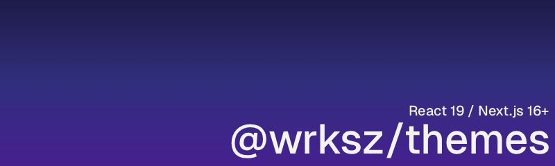

# @wrksz/themes

[](https://www.npmjs.com/package/@wrksz/themes)

Modern theme management for Next.js 16+ and React 19+. Drop-in replacement for `next-themes` - fixes every known bug and adds missing features.

```bash
bun add @wrksz/themes
# or
npm install @wrksz/themes
```

## Setup

Add the provider to your root layout. Add `suppressHydrationWarning` to `<html>` to prevent hydration warnings caused by the inline theme script running before React hydrates.

```tsx
// app/layout.tsx
import { ThemeProvider } from "@wrksz/themes";

export default function RootLayout({ children }: { children: React.ReactNode }) {
  return (
    <html lang="en" suppressHydrationWarning>
      <body>
        <ThemeProvider>{children}</ThemeProvider>
      </body>
    </html>
  );
}
```

## Usage

```tsx
"use client";

import { useTheme } from "@wrksz/themes";

export function ThemeToggle() {
  const { theme, setTheme } = useTheme();

  return (
    <button onClick={() => setTheme(theme === "dark" ? "light" : "dark")}>
      Toggle theme
    </button>
  );
}
```

## API

### `ThemeProvider`

| Prop | Type | Default | Description |
|------|------|---------|-------------|
| `themes` | `string[]` | `["light", "dark"]` | Available themes |
| `defaultTheme` | `string` | `"system"` | Theme used when no preference is stored |
| `forcedTheme` | `string` | - | Force a specific theme, ignoring user preference |
| `enableSystem` | `boolean` | `true` | Detect system preference via `prefers-color-scheme` |
| `enableColorScheme` | `boolean` | `true` | Set native `color-scheme` CSS property |
| `attribute` | `string \| string[]` | `"class"` | HTML attribute(s) to set on target element (`"class"`, `"data-theme"`, etc.) |
| `value` | `Record<string, string>` | - | Map theme names to attribute values |
| `target` | `string` | `"html"` | Element to apply theme to (`"html"`, `"body"`, or a CSS selector) |
| `storageKey` | `string` | `"theme"` | Key used for storage |
| `storage` | `"localStorage" \| "sessionStorage" \| "none"` | `"localStorage"` | Where to persist the theme |
| `disableTransitionOnChange` | `boolean` | `false` | Disable CSS transitions when switching themes |
| `themeColor` | `string \| Record<string, string>` | - | Update `<meta name="theme-color">` on theme change |
| `nonce` | `string` | - | CSP nonce for the inline script |
| `onThemeChange` | `(theme: string) => void` | - | Called whenever the resolved theme changes |

### `useTheme`

```tsx
const {
  theme,         // Current theme - may be "system"
  resolvedTheme, // Actual theme - never "system"
  systemTheme,   // System preference: "light" | "dark" | undefined
  forcedTheme,   // Forced theme if set
  themes,        // Available themes
  setTheme,      // Set theme
} = useTheme();
```

Supports generics for full type safety:

```tsx
type AppTheme = "light" | "dark" | "high-contrast";

const { theme, setTheme } = useTheme<AppTheme>();
// theme: AppTheme | "system" | undefined
// setTheme: (theme: AppTheme | "system") => void
```

## Examples

### Custom themes with Tailwind

```tsx
<ThemeProvider
  themes={["light", "dark", "high-contrast"]}
  attribute="class"
>
  {children}
</ThemeProvider>
```

### Data attribute instead of class

```tsx
<ThemeProvider attribute="data-theme">
  {children}
</ThemeProvider>
```

```css
[data-theme="dark"] { --bg: #000; }
[data-theme="light"] { --bg: #fff; }
```

### Custom attribute values

```tsx
<ThemeProvider
  themes={["light", "dark"]}
  attribute="data-mode"
  value={{ light: "light-mode", dark: "dark-mode" }}
>
  {children}
</ThemeProvider>
```

### Meta theme-color (Safari / PWA)

```tsx
<ThemeProvider
  themeColor={{ light: "#ffffff", dark: "#0a0a0a" }}
>
  {children}
</ThemeProvider>
```

Works with CSS variables too:

```tsx
<ThemeProvider themeColor="var(--color-background)">
  {children}
</ThemeProvider>
```

### Disable storage

```tsx
// No persistence - always uses defaultTheme or system preference
<ThemeProvider storage="none" defaultTheme="dark">
  {children}
</ThemeProvider>
```

### Forced theme per page

```tsx
// app/dashboard/layout.tsx
<ThemeProvider forcedTheme="dark">
  {children}
</ThemeProvider>
```

### Class on body instead of html

```tsx
<ThemeProvider target="body">
  {children}
</ThemeProvider>
```

## Why not `next-themes`?

| Issue | next-themes | @wrksz/themes |
|-------|-------------|---------------|
| React 19 script warning | Yes | Fixed (RSC split) |
| `__name` minification bug | Yes | Fixed |
| React 19 Activity/cacheComponents stale theme | Yes | Fixed (`useSyncExternalStore`) |
| `sessionStorage` support | No | Yes |
| Disable storage | No | Yes (`storage: "none"`) |
| `meta theme-color` support | No | Yes (`themeColor` prop) |
| Generic types | No | Yes (`useTheme<AppTheme>()`) |
| Zero runtime dependencies | Yes | Yes |

## License

MIT
